# 🎯 NARAKA: BLADEPOINT Aim Assist Tool – Smart Targeting for Every Duel

Perfect timing wins fights — and the **NARAKA: BLADEPOINT Aim Assist Tool** ensures you never miss a strike.
Developed for serious players, it brings **machine-calibrated precision**, **predictive movement tracking**, and **realistic aim correction** to both melee and ranged encounters.

Unlike conventional systems, this assist tool doesn’t just “snap” to enemies — it **learns your movement rhythm**, compensates for weapon recoil, and subtly guides your crosshair to maximize hit probability without breaking immersion.

---

## ⚙️ Overview

The **NARAKA Aim Assist** system combines real-time tracking with fine-tuned prediction models for every weapon type.
Whether you’re using a **Katana**, **Longsword**, or **Bow**, the algorithm adapts to the unique hit timing and distance curve of each weapon, improving consistency without breaking natural gameplay feel.

[!NOTE]

> The tool runs externally — no direct memory modification. It overlays predictive movement and angle correction via secure kernel driver for stability and safety.

### Key Benefits

* Precision-lock tracking with parry assist timing
* Smart FOV calibration (auto-adjusts during grappling or dodging)
* Smooth targeting curves for both melee and ranged attacks
* Dynamic recoil compensation for projectile weapons
* Fully controller compatible (Xbox & DualShock)
* Stream-safe rendering and overlay protection

---

## 🧩 Feature List

| Feature                   | Description                                                            |
| ------------------------- | ---------------------------------------------------------------------- |
| **Adaptive Lock-On**      | Predicts opponent dashes and repositions your crosshair automatically. |
| **Weapon Sync Engine**    | Adjusts aim response depending on current weapon.                      |
| **Smooth Motion Pathing** | Mimics natural human micro-movements to stay undetectable.             |
| **Parry Assist**          | Times counter inputs automatically when lock is active.                |
| **Dynamic FOV Scaling**   | Expands or contracts FOV based on target distance.                     |
| **Profile Presets**       | Store configs for melee, ranged, and hybrid loadouts.                  |

---

## 💻 Compatibility

| Platform                             | Supported |
| ------------------------------------ | --------- |
| **Windows 10 / 11 (x64)**            | ✅         |
| **Steam / Epic / Xbox Game Pass PC** | ✅         |
| **Controllers (Xbox / DualShock)**   | ✅         |
| **Full-Screen & Borderless Mode**    | ✅         |

[!IMPORTANT]

> Use only the verified loader. Unofficial versions can cause injection instability or input delay.

---

## ⚡ Setup Instructions

1. **Download** the verified `NARAKA_AimAssist.zip` archive.
2. **Extract** it to your desktop.
3. **Run** `AimAssist_Loader.exe` as Administrator.
4. Launch *NARAKA: BLADEPOINT* normally.
5. Wait for the calibration message, then press:

   ```bash
   F2 – Enable Aim Assist  
   F3 – Toggle Parry Assist  
   F4 – Adjust FOV Range  
   F6 – Save Config  
   F8 – Load Config  
   ```
6. Fine-tune your sensitivity curve and strength settings in the overlay UI.

[!WARNING]

> Avoid changing assist parameters mid-combat — update them only from safe zones or pre-game lobby.

---

### 🧠 Operation Flow Diagram

```mermaid
flowchart LR
A[Launch Loader] --> B[Detect Game Process]
B --> C{Weapon Type?}
C -- Melee --> D[Engage Parry Timing + Close Aim Curve]
C -- Ranged --> E[Activate Recoil + FOV Compensation]
D --> F[Smart Lock Module]
E --> F
F --> G[Target Tracking Active 🎯]
```



---

## 🔧 Configurable Settings

You can customize the assist behavior in `settings.json`:

```json
{
  "aim_strength": 0.75,
  "smoothness": 0.6,
  "fov_radius": 45,
  "enable_parry_assist": true,
  "assist_curve": "natural",
  "controller_mode": true
}
```

### Popular Presets

* **Balanced Mode:** 70% strength, smooth tracking for all weapons.
* **Sniper Mode:** Low FOV, slower acceleration for ranged precision.
* **Aggressive Mode:** Fast response and expanded cone for melee rush.

---

## ❓ FAQ

**Q: Does this support the latest patch?**
Yes. Offsets and tracking parameters update automatically via cloud sync after each patch.

**Q: Is controller aim smoothing available?**
Yes — analog input curves are mapped for both Xbox and DualShock devices.

**Q: Can I use this with other visual tools?**
Yes. Fully compatible with ESP and loot radar overlays.

**Q: Will this affect game performance?**
Minimal impact — CPU usage under 2%, with hardware acceleration for FOV calculations.

**Q: Are updates frequent?**
Yes. Weekly updates ensure stability and compatibility with all NARAKA builds.

---

## 🏁 Final Thoughts

The **NARAKA: BLADEPOINT Aim Assist Tool** transforms reactive combat into **predictive precision**.
With its blend of AI-based targeting and adaptive calibration, every parry, strike, and ranged shot lands exactly where you intend — without jerky or robotic motion.

Whether you’re a duelist mastering close fights or a ranged tactician seeking consistent headshots, this software becomes your silent partner in victory.


---

*© 2025 NARAKA: BLADEPOINT Aim Assist Tool. Calibrated for precision, stability, and competitive control.*
